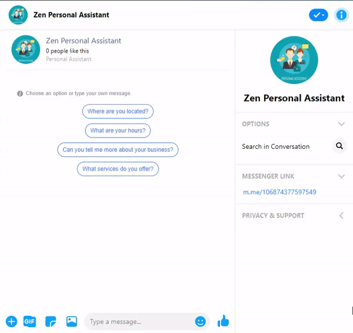
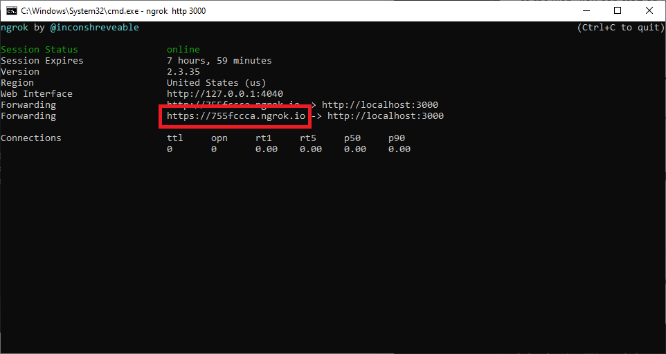

# Messenger Bot in Node.JS

This is a messenger bot which will assist you to count your next birthday down. This bot also uses some basic natural language processing from facebook to process the user's sentiments.

### Content

- [Technology stack](#technology-stack)
- [Demo](#demo)
- [Documentation](#documentation)
- [Installation](#installation)
    - [Cloning The Repository](#cloning-the-repository)
    - [Installing Dependencies](#installing-dependencies)
    - [Preparing Database](#preparing-database)
    - [Testing API Service](#testing-api-service)
    - [Run API Service](#run-api-service)
    - [Exposing Your Service To The Web](#exposing-your-service-to-the-web)
    - [Setting Up Your Facebook App](#setting-up-your-facebook-app)

## Technology stack
- MySQL
- NodeJS
    - Lint: ESLint
    - Unit Test: Jest
- Server: Heroku and/or Ngrok (localhost)

## Demo
You can check out the demo messenger bot at http://m.me/106874377597549. This demo bot service is deployed to Heroku Cloud Platform and its database is hosted on JawsDB MySQL. You can check out the main interaction from the gif below.



Note: If the messenger bot is not working properly, feel free to contact me at christzenleonardy@gmail.com.

## Documentation
To see the list of services you can use from this API Web Service, please check out our [documentation](https://documenter.getpostman.com/view/6370911/SzRxV9xE).

Note: If the hyperlink doesn't work, you can open it at https://documenter.getpostman.com/view/6370911/SzRxV9xE.

## Installation
If you plan to run it by yourself, you can follow these steps.

### Cloning The Repository
Firstly, clone this repository.
```
git clone https://github.com/christzenleonardy/messenger-bot.git
```

### Installing Dependencies
Move to the repository folder using `cd` and install the required dependencies.
```
npm install
```
If you don't plan to deploy your app at cloud-based service (Heroku, AWS EC2 instance), you need to install [ngrok](https://ngrok.io/) because it will be used for exposing your localhost server to the web.

### Preparing Database
Before running the service, make sure you have a working zen personal assistant database. If you don't have one, you can import `zen_personal_assistant.sql` into your MySQL database management system.

Note: If you plan to run your database on different host, make sure to update the host, user, and password at `conn.js`.

### Testing API Service
```
npm test
```

### Run API Service
```
npm start
```
After starting the service, try to hit `http://localhost:3000` or your `host:port` of choice. If you get the response below, your service is good to go!
```json
{
    "status": 200,
    "values": "Hello from the Node JS RESTful side!"
}
```

### Exposing Your Service To The Web
Feel free to deploy your service at a cloud-based service like Heroku or AWS EC2 instance, or some other (just make sure you have HTTPS support). To get you started faster, we are going to use our own hardware as the server. After you run your service on localhost, you can use [ngrok](https://ngrok.io/) to expose your localhost server to the web. You can start an HTTP Tunnel on port 3000 or your port of choice with the following command:
```
./ngrok http 3000
```
You can use the URLs in red bracket for your webhook URL at the next step.


### Setting Up Your Facebook App
You can follow the guide here at https://developers.facebook.com/docs/messenger-platform/getting-started/app-setup.

##### Additional Note:
1. Your webhook URL is the ngrok HTTPS URL or public address of your cloud-based service
2. You can see the verify token as `VERIFY_TOKEN` at `controller.js` inside `verifyWebhook` function
3. After you generate token for your authorized page, you can add it to `process.env.PAGE_ACCESS_TOKEN`.

## Test Coverage

\>= 95%